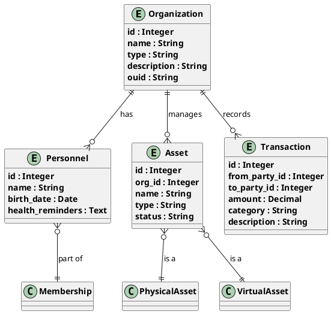

# Project Management Agent - PM规范文档

> **审核状态**: ✅ 已审核  
> **最后更新**: 2026-07-21  
> **版本**: 1.0

## 📋 目录
1. [PM角色定位](#pm角色定位)
2. [项目组织结构](#项目组织结构)
3. [进度跟踪规范](#进度跟踪规范)
4. [质量检查标准](#质量检查标准)
5. [团队分工细则](#团队分工细则)
6. [建模工作规范](#建模工作规范)

---

## PM角色定位

### 角色职责
PM（Project Manager）负责项目的整体规划、进度控制和质量保障：

| 职责 | 描述 |
|------|------|
| **项目规划** | 制定项目计划、里程碑和交付标准 |
| **进度控制** | 跟踪任务进度、识别风险、调整计划 |
| **质量保障** | 制定质量标准、组织质量检查 |
| **团队协调** | 分配任务、协调资源、沟通汇报 |

### 与SA（系统分析师）协作
```
┌─────────────────────────────────────────────────────────────┐
│                    项目流程协作                                 │
├─────────────────────────────────────────────────────────────┤
│                                                              │
│   PM负责：                   SA负责：                          │
│   ──────────               ──────────                        │
│   • 项目计划制定           • 需求分析                         │
│   • 进度跟踪               • 系统建模                         │
│   • 质量检查               • UML建模                          │
│   • 团队协调               • 架构设计                         │
│   • 交付管理               • 技术方案制定                     │
│                                                              │
│   └─────► 合作 ◄─────┘                                      │
│           协同推进项目                                        │
└─────────────────────────────────────────────────────────────┘
```

---

## 项目组织结构

### 组织架构

```
┌─────────────────────────────────────────────────────────────┐
│                  Uni-Resource Agent项目组织                     │
├─────────────────────────────────────────────────────────────┤
│                                                              │
│                     ┌──────────┐                               │
│                     │   项目经理 │                             │
│                     │   (PM)   │                               │
│                     └─────┬────┘                               │
│                           │                                    │
│           ┌───────────────┼───────────────┐                   │
│           ▼               ▼               ▼                   │
│    ┌──────────┐    ┌──────────┐    ┌──────────┐             │
│    │  开发组长  │    │ 质量观察员 │    │  SA团队   │             │
│    │   (TL)   │    │  (QA)    │    │ (System   │             │
│    └─────┬────┘    └─────┬────┘    │  Analyst) │             │
│          │               │          └─────┬────┘             │
│    ┌─────┴────┐    ┌─────┴────┐          │                   │
│    ▼          ▼    ▼          ▼    ┌─────┴────┐             │
│  ┌───┐    ┌───┐  ┌───┐    ┌───┐  │   SA1    │             │
│  │ Dev1 │  │ Dev2 │ │ Dev3 │  │ Dev4 │  │   SA2    │             │
│  └───┘    └───┘  └───┘    └───┘  └──────────┘             │
│    │          │      │          │                             │
│    └────┬─────┘      └────┬─────┘                            │
│         │                 │                                    │
│    ┌────┴────┐      ┌────┴────┐                             │
│    ▼         ▼      ▼         ▼                             │
│   工具开发   数据库   前端     后端                           │
│                                                              │
└─────────────────────────────────────────────────────────────┘
```

### 角色职责矩阵

| 角色 | 项目规划 | 进度跟踪 | 质量检查 | 团队协调 | 建模设计 | 技术实现 |
|------|---------|---------|---------|---------|---------|---------|
| PM | ★★★ | ★★★ | ★★★ | ★★★ | ★ | ★ |
| SA | ★ | ★ | ★ | ★ | ★★★ | ★★★ |
| TL | ★ | ★ | ★ | ★★ | ★ | ★★★ |
| QA | ★ | ★ | ★★★ | ★★ | ★ | ★ |

---

## 进度跟踪规范

### 里程碑管理

| 里程碑 | 目标日期 | 状态 | 负责人 |
|--------|---------|------|--------|
| GitHub仓库创建 | 7/15 | ✅ | PM |
| 基础设施脚本就绪 | 7/20 | ✅ | TL |
| 工具函数全部通过 | 7/25 | ✅ | TL |
| Agent CPU模式跑通 | 7/28 | ✅ | PM |
| 云资源审批确认 | 7/31 | ✅ | PM |
| AMD GPU验证完成 | 8/3 | 🔴 | PM |
| 演示视频录制完成 | 8/5 | 🔴 | QA |
| 全部提交就绪 | 8/6 12:00 | 🔴 | PM |

### 进度跟踪流程

```
┌─────────────────────────────────────────────────────────────┐
│                    进度跟踪流程                                 │
├─────────────────────────────────────────────────────────────┤
│                                                              │
│   ┌─────────────┐                                           │
│   │   每日站会    │                                           │
│   │  (15分钟)   │                                           │
│   └──────┬──────┘                                           │
│          ▼                                                   │
│   ┌─────────────┐                                           │
│   │ 任务完成情况  │                                           │
│   │  更新跟踪表   │                                           │
│   └──────┬──────┘                                           │
│          ▼                                                   │
│   ┌─────────────┐                                           │
│   │  PM审核确认   │                                           │
│   └──────┬──────┘                                           │
│          ▼                                                   │
│   ┌─────────────┐     ┌─────────────┐                       │
│   │   按计划推进   │     │   存在风险   │                       │
│   └─────────────┘     └──────┬──────┘                       │
│                              ▼                              │
│                    ┌─────────────┐                          │
│                    │  识别风险项   │                          │
│                    └──────┬──────┘                          │
│                           │                                  │
│              ┌────────────┴────────────┐                    │
│              ▼                         ▼                    │
│        ┌─────────────┐         ┌─────────────┐              │
│        │   低风险     │         │   高风险     │              │
│        └──────┬──────┘         └──────┬──────┘              │
│               │                       │                     │
│               ▼                       ▼                     │
│     ┌─────────────┐         ┌─────────────┐                 │
│     │  继续跟踪    │         │  调整计划/   │                 │
│     │              │         │  增加资源    │                 │
│     └─────────────┘         └─────────────┘                 │
│                                                              │
└─────────────────────────────────────────────────────────────┘
```

### 进度报告格式

```markdown
## 周报 - 2026-W29

### 本周完成
- [x] 基础设施脚本就绪
- [x] 工具函数全部通过
- [x] Agent CPU模式跑通

### 进行中
- [ ] AMD GPU验证
- [ ] 演示视频录制

### 待办
- [ ] 项目说明文档
- [ ] 最终提交

### 风险与问题
| 问题 | 严重程度 | 解决方案 | 负责人 |
|------|---------|---------|--------|
| GPU资源审批延迟 | 高 | 已提交申请，等待回复 | PM |

### 下周计划
- [ ] AMD GPU验证完成
- [ ] 演示视频录制
- [ ] 项目说明文档定稿
```

---

## 质量检查标准

### 代码质量检查

| 检查项 | 标准 | 检查方式 | 通过标准 |
|--------|------|---------|---------|
| Type Hints | 所有函数必须有类型注解 | 静态检查 | 100%覆盖 |
| 工具装饰器 | 工具函数必须使用@tool | 代码审查 | 100%覆盖 |
| 环境变量 | 无硬编码路径或密钥 | 代码审查 | 100%符合 |
| SQL注入 | 参数化查询 | 静态检查 | 0风险 |
| requirements.txt | 版本号固定 | 代码审查 | 100%符合 |
| .env.example | 包含所有必需变量 | 代码审查 | 100%符合 |
| CPU模式运行 | 本地CPU模式能跑通 | 功能测试 | 通过 |

### 文档质量检查

| 检查项 | 标准 | 检查方式 | 通过标准 |
|--------|------|---------|---------|
| README.md | 完整项目介绍 | 代码审查 | 包含所有必要章节 |
| CLAUDE.md | 存在并指向AGENTS.md | 代码审查 | 存在且正确 |
| AGENTS.md | 完整上下文文档 | 代码审查 | 包含所有模块说明 |
| 项目说明文档 | 5个完整章节 | 代码审查 | 1-5章齐全 |
| Agent架构图 | 已绘制 | 文档审查 | 存在且清晰 |

### API质量检查

| 检查项 | 标准 | 检查方式 | 通过标准 |
|--------|------|---------|---------|
| RESTful规范 | 符合RESTful设计 | 代码审查 | 全部符合 |
| 错误码规范 | 统一错误码定义 | 代码审查 | 100%覆盖 |
| 文档完整性 | API文档完整 | 代码审查 | 100%覆盖 |

### 测试质量检查

| 检查项 | 标准 | 检查方式 | 通过标准 |
|--------|------|---------|---------|
| 单元测试 | 覆盖核心功能 | 代码审查 | 80%+覆盖率 |
| 集成测试 | API集成测试 | 代码审查 | 100%覆盖 |
| TDD流程 | 通过项目经理审核 | 代码审查 | 已审核 |

---

## 团队分工细则

### 项目经理（PM）

#### 主要职责
1. **项目规划**
   - 制定项目计划和里程碑
   - 分配资源和任务
   - 制定质量标准

2. **进度控制**
   - 每日站会主持
   - 进度跟踪和报告
   - 风险识别和应对

3. **质量保障**
   - 制定质量标准
   - 组织质量检查
   - 质量问题跟进

4. **团队协调**
   - 团队成员协调
   - 跨部门沟通
   - 问题解决

5. **交付管理**
   - 最终交付物检查
   - 提交材料准备
   - 提交和汇报

#### 负责模块
- `agents/agent.py`
- `models/llm_client.py`
- `db/postgres_client.py`
- `db/chroma_client.py`
- `auth/auth.py`
- `app.py`
- `AGENTS.md`
- `README.md`

### 开发组长（TL）

#### 主要职责
1. **技术实现**
   - 核心代码开发
   - 技术方案制定
   - 代码审查

2. **基础设施**
   - 脚本开发
   - 部署配置
   - 环境搭建

3. **文档编写**
   - 技术文档
   - API文档
   - 开发指南

4. **质量保证**
   - 单元测试
   - 集成测试
   - 测试覆盖率

#### 负责模块
- `requirements.txt`
- `.env.example`
- `Dockerfile`
- `docker-compose.yml`
- `scripts/`
- `src/tools/`
- `src/db/`
- `src/auth/`

### 质量观察员（QA）

#### 主要职责
1. **质量标准制定**
   - 质量检查清单
   - 测试标准
   - 文档标准

2. **质量检查**
   - 代码审查
   - 测试执行
   - 文档审查

3. **问题追踪**
   - Bug追踪
   - 问题汇总
   - 改进措施

4. **测试管理**
   - 测试用例编写
   - 测试执行
   - 测试报告

#### 负责模块
- 测试用例
- 测试脚本
- 测试报告
- 质量检查清单

### SA团队（系统分析师）

#### 主要职责
1. **需求分析**
   - 用户需求分析
   - 业务流程分析
   - 功能规格定义

2. **系统建模**
   - UML建模
   - 类图设计
   - 序列图设计

3. **架构设计**
   - 系统架构设计
   - 技术选型
   - 架构文档编写

4. **技术方案**
   - 技术方案制定
   - 技术评审
   - 技术指导

#### 负责模块
- `agents/SA_AGENT.md`
- `agents/_pm/`
- `docs/architecture.md`
- `docs/requirements.md`

---

## 建模工作规范

### 建模原则

#### 1. 一致性原则
```
所有建模文档必须遵循以下规范：
- 统一的术语定义
- 统一的符号表示
- 统一的文档格式
```

#### 2. 完整性原则
```
建模必须覆盖：
- 所有核心业务流程
- 所有数据实体
- 所有系统交互
- 所有约束条件
```

#### 3. 可验证性原则
```
建模结果必须可验证：
- 有明确的验证标准
- 有可执行的测试用例
- 有可追溯的需求链接
```

### 建模流程

```
┌─────────────────────────────────────────────────────────────┐
│                    建模工作流程                                 │
├─────────────────────────────────────────────────────────────┤
│                                                              │
│   ┌─────────────┐                                           │
│   │  需求收集    │                                           │
│   └──────┬──────┘                                           │
│          ▼                                                   │
│   ┌─────────────┐                                           │
│   │ 需求分析     │                                           │
│   └──────┬──────┘                                           │
│          ▼                                                   │
│   ┌─────────────┐     ┌─────────────┐                      │
│   │  业务建模    │────▶│  项目经理   │                      │
│   └─────────────┘     │   审核      │                      │
│                       └──────┬──────┘                      │
│                              ▼                              │
│                 ┌─────────────┐                            │
│                 │  审核通过？   │                            │
│                 └──────┬──────┘                            │
│                        │                                     │
│              ┌─────────┴─────────┐                          │
│              ▼                   ▼                          │
│        ┌─────────────┐     ┌─────────────┐                  │
│        │    是        │     │    否        │                  │
│        └──────┬──────┘     └──────┬──────┘                  │
│               │                   │                         │
│               ▼                   ▼                         │
│      ┌─────────────┐     ┌─────────────┐                  │
│      │  生成UML模型 │     │  修改需求/    │                  │
│      │  (PlantUML) │     │  业务建模     │                  │
│      └──────┬──────┘     └──────┬──────┘                  │
│             │                   │                           │
│             └─────────┬─────────┘                           │
│                       ▼                                     │
│              ┌─────────────┐                                │
│              │  技术架构设计  │                                │
│              └──────┬──────┘                                │
│                     │                                        │
│                     ▼                                        │
│              ┌─────────────┐                                │
│              │  实施方案制定  │                                │
│              └─────────────┘                                │
└─────────────────────────────────────────────────────────────┘
```

### 建模文档规范

#### UML建模规范



#### 类图命名规范

| 类型 | 命名规则 | 示例 |
|------|---------|------|
| 实体类 | 首字母大写单数 | User, Organization, Asset |
| 接口 | I + 首字母大写 | IUserService, IAssetManager |
| 实现类 | 首字母大写 + 实现 | UserServiceImpl, AssetManagerImpl |
| 数据类 | 首字母大写 + DTO | UserDTO, AssetDTO |
| 异常类 | Exception结尾 | BusinessException, DataException |

### 建模检查清单

| 检查项 | 标准 | 检查方式 | 通过标准 |
|--------|------|---------|---------|
| 术语一致性 | 统一术语表 | 文档审查 | 无歧义 |
| 模型完整性 | 覆盖所有需求 | 需求追溯 | 100%覆盖 |
| 模型一致性 | 内部逻辑一致 | 逻辑检查 | 无冲突 |
| UML规范 | 符合UML标准 | 代码审查 | 100%符合 |
| 文档完整 | 文档齐全 | 文档检查 | 100%齐全 |

---

## 版本历史

| 版本 | 日期 | 变更内容 |
|------|------|---------|
| 1.0 | 2026-07-21 | 初始版本，定义PM规范 |

---

## 附录

### A. 相关文档
- [`AGENTS.md`](AGENTS.md) - 项目核心文档
- [`SA_AGENT.md`](SA_AGENT.md) - 系统分析师规范
- [`TDD_AGENT.md`](TDD_AGENT.md) - 测试驱动开发规范
- [`DBA_AGENT.md`](DBA_AGENT.md) - 数据库管理规范

### B. 联系方式
- 项目邮箱：agent@unires.com
- 技术支持：tech@unires.com
- 项目管理：pm@unires.com
