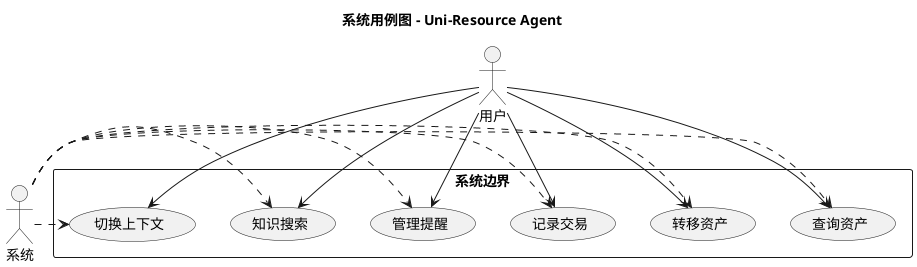
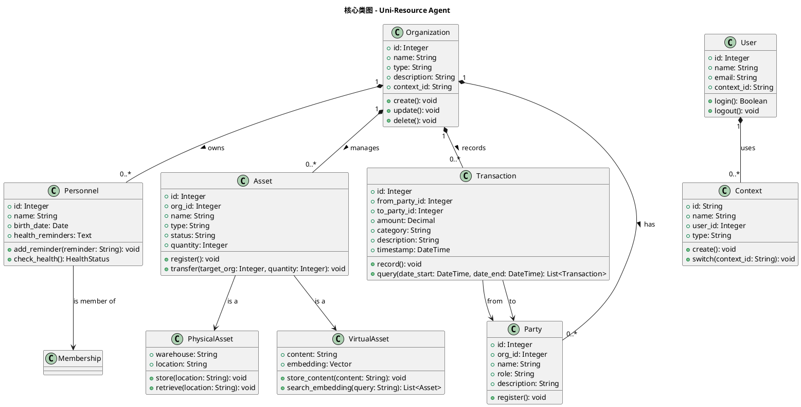
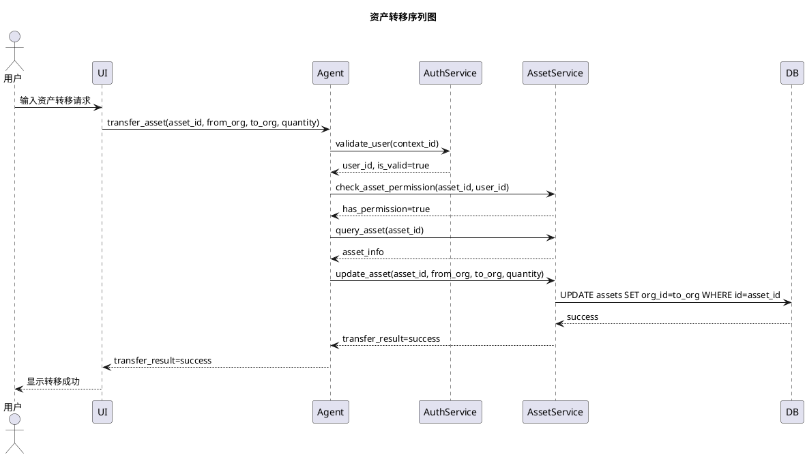
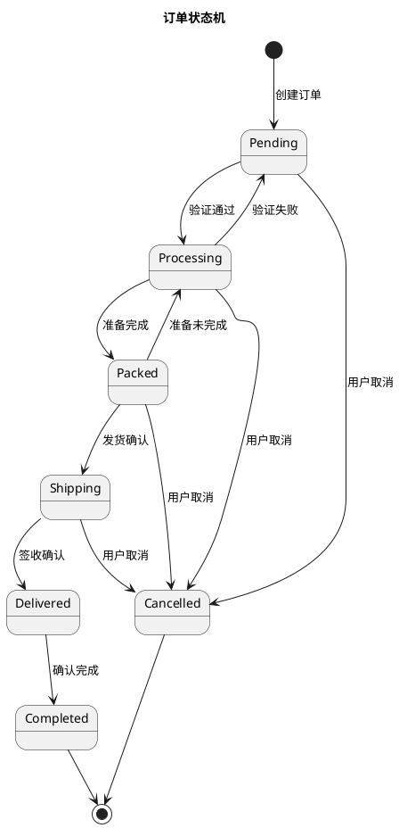
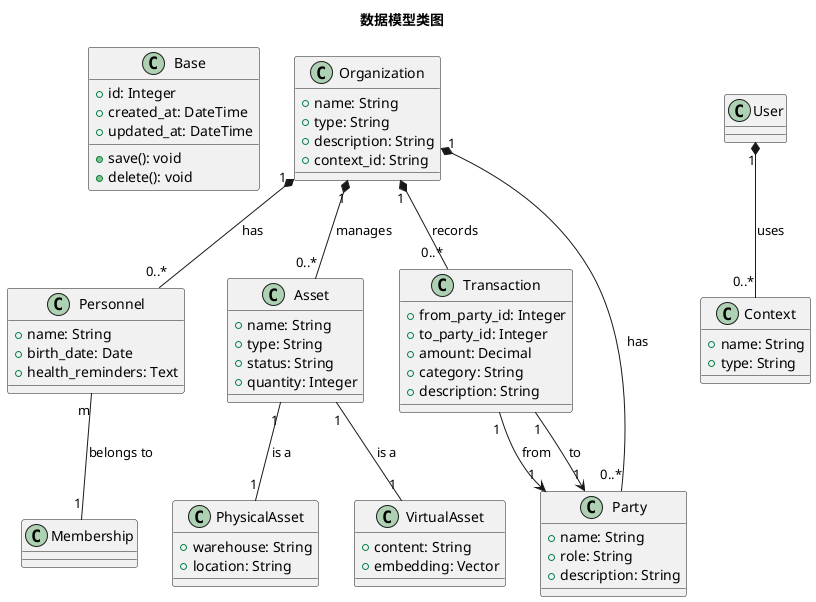
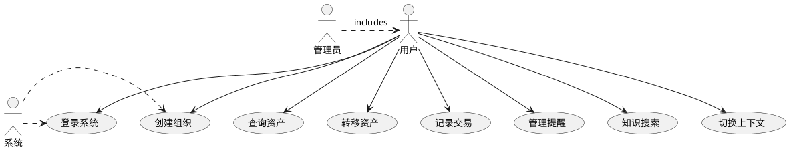
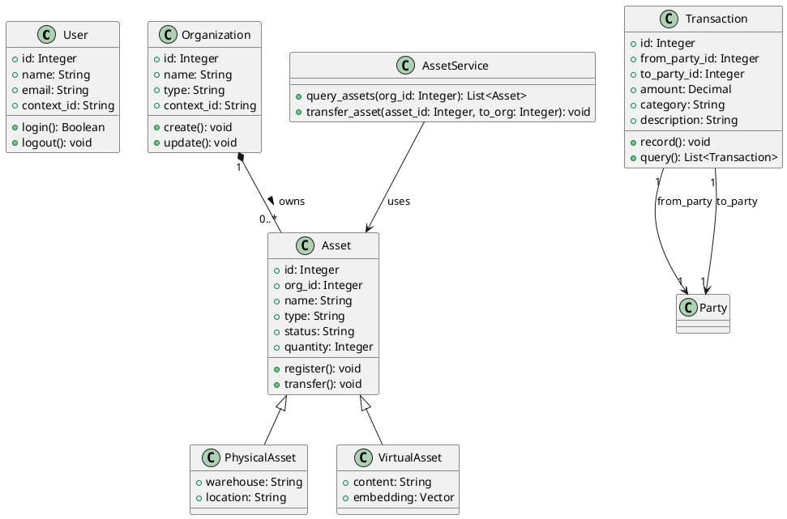
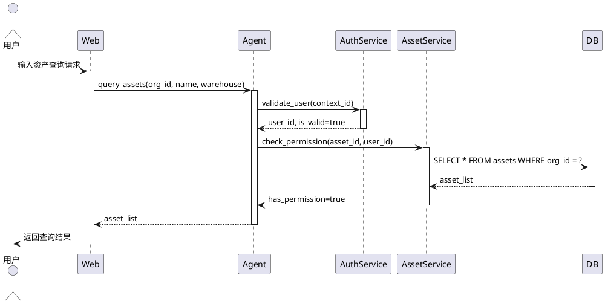
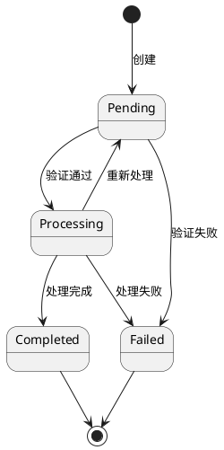
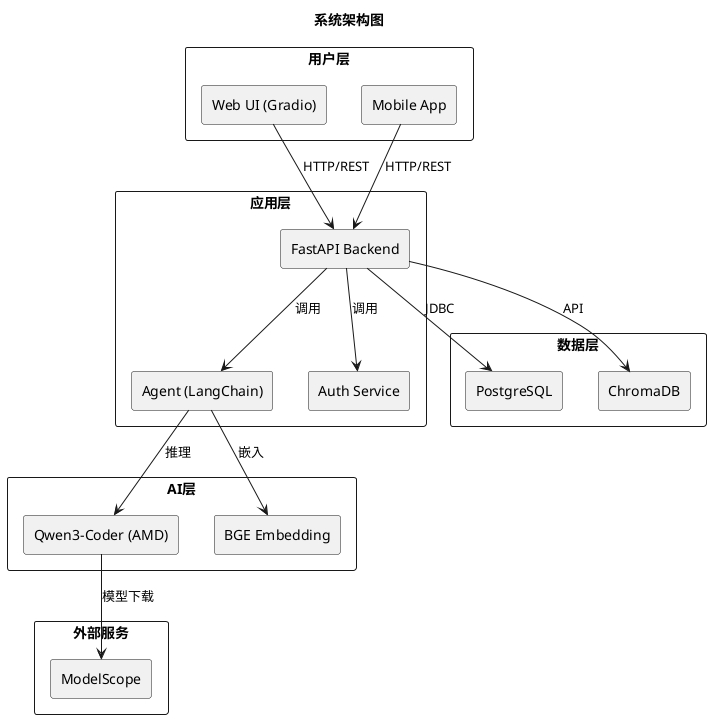

# System Analyst Agent - SA规范文档

> **审核状态**: ✅ 已审核  
> **最后更新**: 2026-07-21  
> **版本**: 1.0

## 📋 目录
1. [SA角色定位](#sa角色定位)
2. [建模工作规范](#建模工作规范)
3. [需求分析流程](#需求分析流程)
4. [UML建模规范](#uml建模规范)
5. [架构设计规范](#架构设计规范)
6. [SA与PM协作](#sa与pm协作)

---

## SA角色定位

### 角色职责
SA（System Analyst）负责系统的建模、分析和架构设计工作，基于 `/agents/pm/ai-modeling.md` 的规范开展工作：

| 职责 | 描述 |
|------|------|
| **需求分析** | 分析用户需求、业务流程、功能规格 |
| **系统建模** | 创建UML模型、类图、序列图、状态图 |
| **架构设计** | 设计系统架构、技术方案、数据模型 |
| **文档编写** | 编写需求文档、设计文档、架构文档 |
| **技术评审** | 参与代码评审、方案评审、质量评审 |

### SA工作范围

```
┌─────────────────────────────────────────────────────────────┐
│                    SA工作范围                                   │
├─────────────────────────────────────────────────────────────┤
│                                                              │
│   ┌─────────────────────────────────────────────────────┐    │
│   │                  需求分析阶段                          │    │
│   │   • 用户需求调研                                       │    │
│   │   • 业务流程分析                                       │    │
│   │   • 功能规格定义                                       │    │
│   │   • 需求文档编写                                       │    │
│   └─────────────────────────────────────────────────────┘    │
│                              │                               │
│                              ▼                               │
│   ┌─────────────────────────────────────────────────────┐    │
│   │                  系统建模阶段                          │    │
│   │   • UML建模（用例图、类图、序列图）                   │    │
│   │   • 业务流程建模                                       │    │
│   │   • 数据建模                                           │    │
│   │   • 状态机建模                                         │    │
│   └─────────────────────────────────────────────────────┘    │
│                              │                               │
│                              ▼                               │
│   ┌─────────────────────────────────────────────────────┐    │
│   │                架构设计阶段                            │    │
│   │   • 系统架构设计                                       │    │
│   │   • 技术方案制定                                       │    │
│   │   • 数据库设计                                         │    │
│   │   • API接口设计                                        │    │
│   └─────────────────────────────────────────────────────┘    │
│                              │                               │
│                              ▼                               │
│   ┌─────────────────────────────────────────────────────┐    │
│   │                实施支持阶段                            │    │
│   │   • 技术方案讲解                                       │    │
│   │   • 代码评审参与                                       │    │
│   │   • 问题答疑                                           │    │
│   └─────────────────────────────────────────────────────┘    │
└─────────────────────────────────────────────────────────────┘
```

---

## 建模工作规范

### 建模原则

#### 1. 一致性原则
```
所有建模文档必须遵循以下规范：
- 统一的术语定义（见术语表）
- 统一的符号表示（符合UML标准）
- 统一的文档格式（PlantUML模板）
```

#### 2. 完整性原则
```
建模必须覆盖：
- 所有核心业务流程
- 所有数据实体
- 所有系统交互
- 所有约束条件
```

#### 3. 可验证性原则
```
建模结果必须可验证：
- 有明确的验证标准
- 有可执行的测试用例
- 有可追溯的需求链接
```

### PlantUML建模规范

#### 1. 用例图规范



#### 2. 类图规范



#### 3. 序列图规范



#### 4. 状态机图规范



### 建模模板

#### 用例规约模板

```markdown
## 用例规约

### 用例名称
查询资产

### 用例编号
UC-ASSET-001

### 优先级
高

### 执行者
用户

### 前置条件
- 用户已登录系统
- 用户拥有查询权限

### 后置条件
- 系统返回符合条件的资产列表
- 若无结果，返回空列表

### 基本路径
1. 用户进入资产查询界面
2. 用户输入查询条件（名称、类型、仓库等）
3. 系统验证查询条件
4. 系统执行查询
5. 系统返回查询结果
6. 用户查看查询结果

### 扩展路径
1a. 用户未登录
   - 系统提示用户登录
   - 返回路径1

1b. 用户无查询权限
   - 系统提示权限不足
   - 返回路径1

2a. 查询条件无效
   - 系统提示无效条件
   - 返回路径2

2b. 查询无结果
   - 系统提示无结果
   - 返回路径5

### 异常路径
1. 数据库连接失败
   - 系统提示连接错误
   - 记录错误日志
   - 返回路径5

2. 查询超时
   - 系统提示超时
   - 记录错误日志
   - 返回路径5

### 业务规则
- 查询结果按创建时间倒序排列
- 默认显示最近100条记录
- 支持分页查询
- 查询条件支持模糊匹配

### 限制
- 单次查询结果不超过1000条
- 查询条件不能为空

### 关联用例
- 创建资产（UC-ASSET-002）
- 转移资产（UC-ASSET-003）
- 删除资产（UC-ASSET-004）

### 修改记录
| 版本 | 日期 | 修改内容 | 修改人 |
|------|------|---------|--------|
| 1.0 | 2026-07-21 | 初始版本 | SA |
```

#### 类图规范



---

## 需求分析流程

### 需求获取流程

```
┌─────────────────────────────────────────────────────────────┐
│                    需求获取流程                                 │
├─────────────────────────────────────────────────────────────┤
│                                                              │
│   ┌─────────────┐                                           │
│   │ 需求收集     │                                           │
│   │ • 用户访谈  │                                           │
│   │ • 问卷调查  │                                           │
│   │ • 文档分析  │                                           │
│   └──────┬──────┘                                           │
│          ▼                                                   │
│   ┌─────────────┐                                           │
│   │ 需求整理     │                                           │
│   │ • 分类汇总  │                                           │
│   │ • 去重合并  │                                           │
│   │ • 补充完善  │                                           │
│   └──────┬──────┘                                           │
│          ▼                                                   │
│   ┌─────────────┐     ┌─────────────┐                      │
│   │  初步分析    │────▶│   项目经理   │                      │
│   └─────────────┘     │   评审      │                      │
│                       └──────┬──────┘                      │
│                              ▼                              │
│                 ┌─────────────┐                            │
│                 │  通过评审？   │                            │
│                 └──────┬──────┘                            │
│                        │                                     │
│              ┌─────────┴─────────┐                          │
│              ▼                   ▼                          │
│        ┌─────────────┐     ┌─────────────┐                  │
│        │    是        │     │    否        │                  │
│        └──────┬──────┘     └──────┬──────┘                  │
│               │                   │                         │
│               ▼                   ▼                         │
│      ┌─────────────┐     ┌─────────────┐                  │
│      │  业务建模   │     │  补充调研    │                  │
│      │  (流程图)   │     │  (补充访谈)   │                  │
│      └──────┬──────┘     └──────┬──────┘                  │
│             │                   │                           │
│             └─────────┬─────────┘                           │
│                       ▼                                     │
│              ┌─────────────┐                                │
│              │  需求规格说明书 │                                │
│              │  (SRS)       │                                │
│              └─────────────┘                                │
└─────────────────────────────────────────────────────────────┘
```

### 需求确认流程

```markdown
## 需求确认清单

### 功能需求确认
- [ ] 用户能创建/修改/删除组织
- [ ] 用户能添加/修改/删除人员
- [ ] 用户能查询/转移/记录资产
- [ ] 用户能记录/查询交易
- [ ] 用户能设置/查询提醒
- [ ] 用户能搜索知识
- [ ] 系统支持多上下文切换

### 性能需求确认
- [ ] API响应时间 < 500ms
- [ ] 并发支持 > 100用户
- [ ] 数据查询 < 10秒

### 安全需求确认
- [ ] 用户身份验证
- [ ] 权限控制
- [ ] 数据隔离
- [ ] 敏感信息加密

### 业务流程确认
- [ ] 资产查询流程
- [ ] 资产转移流程
- [ ] 交易记录流程
- [ ] 多上下文切换流程

### 确认方式
1. 评审会议
2. 原型演示
3. 用户确认签字
```

---

## UML建模规范

### UML图类型及使用场景

| 图类型 | 用途 | 使用阶段 |
|--------|------|---------|
| 用例图 | 功能需求分析 | 需求分析 |
| 类图 | 系统静态结构 | 架构设计 |
| 序列图 | 对象交互流程 | 详细设计 |
| 状态机图 | 对象状态变化 | 详细设计 |
| 活动图 | 业务流程 | 需求分析 |
| 组件图 | 系统组件关系 | 架构设计 |
| 部署图 | 系统部署结构 | 架构设计 |

### UML建模指南

#### 1. 用例图建模指南



#### 2. 类图建模指南



#### 3. 序列图建模指南



#### 4. 状态机图建模指南



---

## 架构设计规范

### 系统架构图



### 数据库设计规范

#### 1. 数据库表设计

```sql
-- 组织表
CREATE TABLE organization (
    id SERIAL PRIMARY KEY,
    name VARCHAR(255) NOT NULL,
    type VARCHAR(50) NOT NULL,
    description TEXT,
    context_id VARCHAR(100) NOT NULL,
    created_at TIMESTAMP DEFAULT CURRENT_TIMESTAMP,
    updated_at TIMESTAMP DEFAULT CURRENT_TIMESTAMP,
    INDEX idx_context_id (context_id),
    INDEX idx_type (type)
);

-- 人员表
CREATE TABLE personnel (
    id SERIAL PRIMARY KEY,
    name VARCHAR(100) NOT NULL,
    birth_date DATE,
    health_reminders TEXT,
    created_at TIMESTAMP DEFAULT CURRENT_TIMESTAMP,
    updated_at TIMESTAMP DEFAULT CURRENT_TIMESTAMP
);

-- 成员关系表
CREATE TABLE membership (
    id SERIAL PRIMARY KEY,
    person_id INTEGER NOT NULL,
    org_id INTEGER NOT NULL,
    role VARCHAR(50) NOT NULL,
    status VARCHAR(20) DEFAULT 'active',
    created_at TIMESTAMP DEFAULT CURRENT_TIMESTAMP,
    FOREIGN KEY (person_id) REFERENCES personnel(id),
    FOREIGN KEY (org_id) REFERENCES organization(id),
    INDEX idx_org_person (org_id, person_id)
);

-- 资产基表
CREATE TABLE asset (
    id SERIAL PRIMARY KEY,
    org_id INTEGER NOT NULL,
    name VARCHAR(255) NOT NULL,
    type VARCHAR(50) NOT NULL,
    status VARCHAR(20) DEFAULT 'available',
    created_at TIMESTAMP DEFAULT CURRENT_TIMESTAMP,
    updated_at TIMESTAMP DEFAULT CURRENT_TIMESTAMP,
    FOREIGN KEY (org_id) REFERENCES organization(id),
    INDEX idx_org_type (org_id, type)
);

-- 物理资产表
CREATE TABLE physical_asset (
    id INTEGER PRIMARY KEY,
    quantity INTEGER NOT NULL DEFAULT 1,
    warehouse VARCHAR(100),
    location VARCHAR(100),
    FOREIGN KEY (id) REFERENCES asset(id) ON DELETE CASCADE
);

-- 虚拟资产表
CREATE TABLE virtual_asset (
    id INTEGER PRIMARY KEY,
    content TEXT,
    embedding VECTOR(768),
    FOREIGN KEY (id) REFERENCES asset(id) ON DELETE CASCADE
);

-- 参与方表
CREATE TABLE party (
    id SERIAL PRIMARY KEY,
    org_id INTEGER NOT NULL,
    name VARCHAR(255) NOT NULL,
    role VARCHAR(50) NOT NULL,
    description TEXT,
    created_at TIMESTAMP DEFAULT CURRENT_TIMESTAMP,
    FOREIGN KEY (org_id) REFERENCES organization(id)
);

-- 交易表
CREATE TABLE transaction (
    id SERIAL PRIMARY KEY,
    from_party_id INTEGER NOT NULL,
    to_party_id INTEGER NOT NULL,
    amount DECIMAL(15, 2) NOT NULL,
    category VARCHAR(100) NOT NULL,
    description TEXT,
    created_at TIMESTAMP DEFAULT CURRENT_TIMESTAMP,
    FOREIGN KEY (from_party_id) REFERENCES party(id),
    FOREIGN KEY (to_party_id) REFERENCES party(id)
);
```

#### 2. 数据库索引设计

```sql
-- 组织相关索引
CREATE INDEX idx_organization_context ON organization(context_id);
CREATE INDEX idx_organization_type ON organization(type);
CREATE INDEX idx_organization_name ON organization(name);

-- 资产相关索引
CREATE INDEX idx_asset_org_type ON asset(org_id, type);
CREATE INDEX idx_asset_status ON asset(status);
CREATE INDEX idx_asset_name ON asset(name);

-- 交易相关索引
CREATE INDEX idx_transaction_from ON transaction(from_party_id);
CREATE INDEX idx_transaction_to ON transaction(to_party_id);
CREATE INDEX idx_transaction_category ON transaction(category);
CREATE INDEX idx_transaction_date ON transaction(created_at);

-- 成员相关索引
CREATE INDEX idx_membership_org ON membership(org_id);
CREATE INDEX idx_membership_person ON membership(person_id);
```

---

## SA与PM协作

### 协作流程

```
┌─────────────────────────────────────────────────────────────┐
│                  SA与PM协作流程                                 │
├─────────────────────────────────────────────────────────────┤
│                                                              │
│   PM负责：                   SA负责：                          │
│   ──────────               ──────────                        │
│   • 项目计划制定           • 需求分析                         │
│   • 进度跟踪               • 系统建模                         │
│   • 质量检查               • UML建模                          │
│   • 团队协调               • 架构设计                         │
│   • 交付管理               • 技术方案制定                     │
│                                                              │
│   └─────► 协作点 ◄─────┘                                     │
│           │                                                  │
│           ▼                                                  │
│   ┌─────────────────────────────────────────┐                │
│   │         协作成果                          │                │
│   │   • 需求规格说明书 (SRS)                │                │
│   │   • UML模型 (PlantUML)                  │                │
│   │   • 架构设计文档                        │                │
│   │   • 技术方案文档                        │                │
│   └─────────────────────────────────────────┘                │
└─────────────────────────────────────────────────────────────┘
```

### 协作检查点

| 检查点 | PM职责 | SA职责 | 交付物 |
|--------|--------|--------|--------|
| 需求评审 | 组织评审会 | 提供需求分析 | 需求规格说明书 |
| 架构评审 | 评估可行性 | 提供架构设计 | 架构设计文档 |
| 方案评审 | 评估技术方案 | 提供详细方案 | 技术方案文档 |
| 质量检查 | 组织检查 | 提供检查结果 | 质量报告 |

### 沟通机制

```markdown
## SA与PM沟通机制

### 1. 每日站会
- 时间：每天上午10:00
- 时长：15分钟
- 内容：
  - 昨日完成工作
  - 今日计划工作
  - 遇到的问题

### 2. 评审会议
- 需求评审：每周一次
- 架构评审：每个阶段一次
- 技术评审：每月一次

### 3. 邮件/消息通知
- 项目更新：每周一次
- 里程碑完成：及时通知
- 重大问题：立即通知

### 4. 文档共享
- 共享文档：项目文档库
- 版本管理：Git仓库
- 最新文档：项目首页
```

---

## 版本历史

| 版本 | 日期 | 变更内容 |
|------|------|---------|
| 1.0 | 2026-07-21 | 初始版本，定义SA规范 |

---

## 附录

### A. 相关文档
- [`AGENTS.md`](AGENTS.md) - 项目核心文档
- [`PM_AGENT.md`](PM_AGENT.md) - 项目管理规范
- [`TDD_AGENT.md`](TDD_AGENT.md) - 测试驱动开发规范
- [`DBA_AGENT.md`](DBA_AGENT.md) - 数据库管理规范

### B. 工具推荐
- PlantUML：UML建模
- Draw.io：架构图绘制
- Git：版本控制
- Notion：文档协作

### C. 联系方式
- 项目邮箱：agent@unires.com
- 技术支持：tech@unires.com
- 项目管理：pm@unires.com
