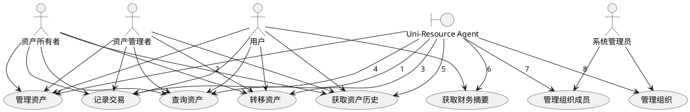

# Uni-Resource Agent 用例图

## 适用场景

该用例图用于表达 Uni-Resource Agent 面向用户、管理员和资产管理角色所提供的核心业务能力。

## 参与者

- 用户
  - 主要执行资产查询、管理、转移、交易记录和财务摘要查看。
- 系统管理员
  - 负责组织成员和组织的管理。
- 资产所有者
  - 具备资产相关的查询与管理权限。
- 资产管理者
  - 具备资产相关的查询与管理权限。

## 系统用例

- 查询资产
- 管理资产
- 转移资产
- 记录交易
- 获取资产历史
- 获取财务摘要
- 管理组织成员
- 管理组织

## 关系说明

- 用户可执行资产查询、管理、转移、交易记录和财务摘要相关用例。
- 管理员负责组织与成员管理。
- 资产所有者和资产管理者共享大部分资产管理用例权限。

## PlantUML 源码

