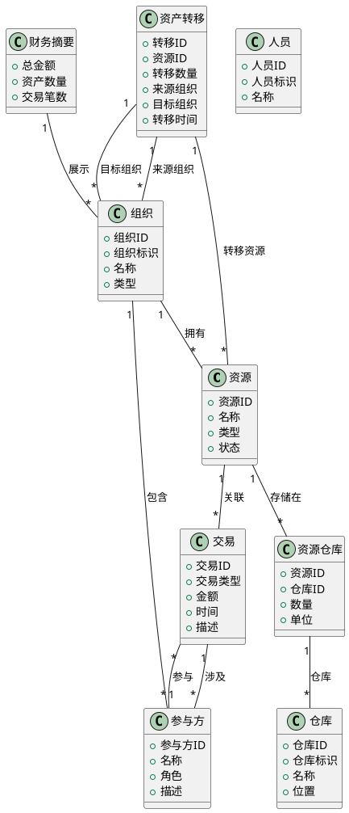

# Uni-Resource Agent 分析类图

## 设计目标

该类图描述 Uni-Resource Agent 中与资源管理、组织协作、交易记录和资产转移相关的核心领域模型，强调系统在多组织场景下如何组织实体与业务关系。

## 核心类

- 资源
  - 资源 ID
  - 名称
  - 类型
  - 状态
- 组织
  - 组织 ID
  - 组织标识
  - 名称
  - 类型
- 人员
  - 人员 ID
  - 人员标识
  - 名称
- 仓库
  - 仓库 ID
  - 仓库标识
  - 名称
  - 位置
- 资源仓库
  - 资源 ID
  - 仓库 ID
  - 数量
  - 单位
- 交易
  - 交易 ID
  - 交易类型
  - 金额
  - 时间
  - 描述
- 参与方
  - 参与方 ID
  - 名称
  - 角色
  - 描述
- 财务摘要
  - 总金额
  - 资产数量
  - 交易笔数
- 资产转移
  - 转移 ID
  - 资源 ID
  - 转移数量
  - 来源组织
  - 目标组织
  - 转移时间

## 主要关系

- 资源存储在资源仓库中，资源仓库属于仓库。
- 组织拥有资源。
- 组织包含参与方。
- 交易涉及参与方。
- 资源与交易有关联。
- 参与方参与交易。
- 财务摘要用于展示组织的财务状态。
- 资产转移操作涉及资源和两个组织。

## PlantUML 源码

