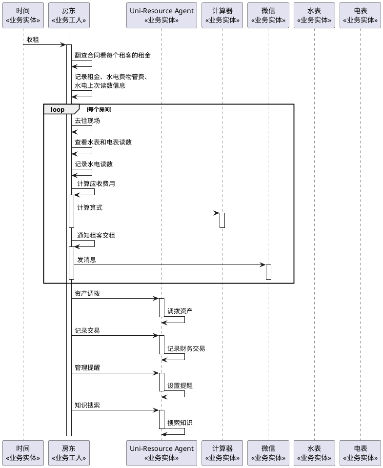

# 改进后业务序列图

## 业务背景

该序列图描述房东在租赁场景下，通过 Uni-Resource Agent 完成收租、费用计算、资产调拨、交易记录和提醒管理等任务的流程。

## 参与者

- 时间
- 房东
- Uni-Resource Agent
- 计算器
- 微信
- 水表
- 电表

## 主要流程

1. 房东收到租金收取请求，翻查合同，整理租金、水电费、物管费与上次读数信息。
2. 针对每个房间，房东前往现场查看水表和电表读数，并记录数据。
3. 根据读数和合同信息，计算应收费用。
4. 房东通过计算器完成算式运算。
5. 房东通过微信通知租客交租。
6. 房东将资产调拨、交易记录和提醒管理任务提交给 Uni-Resource Agent。

## 业务价值

- 将人工核算与系统记录结合，减少漏算和遗漏。
- 将资产调拨、财务记录和提醒管理统一纳入系统流程。
- 支持从租务管理扩展到资源与财务协同管理。

## PlantUML 源码

