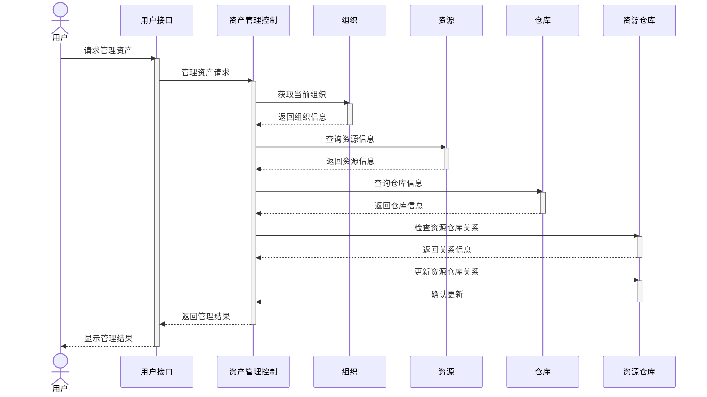

# 管理资产分析序列图

## 用例目标

该序列图描述用户在 Uni-Resource Agent 中执行“管理资产”操作时，系统内部各模块如何协同完成组织信息查询、资源查询、仓库检查与关系更新。

## 参与者

- 用户
- 用户接口
- 资产管理控制
- 资源
- 组织
- 仓库
- 资源仓库

## 交互过程

1. 用户向用户接口发起“管理资产”请求。
2. 用户接口将请求转发给资产管理控制模块。
3. 资产管理控制模块先获取当前组织的信息。
4. 随后查询资源和仓库信息。
5. 检查资源与仓库之间的关联关系。
6. 更新资源仓库关系，完成资产管理动作。
7. 最终将结果返回给用户界面并展示给用户。

## 说明

该流程体现了系统在资产管理场景下的典型控制流：先读取上下文，再确认资源关系，最后完成状态更新。

## 可视化序列图



## PlantUML 源码

```plantuml
@startuml
' 管理资产用例的分析序列图

' 参与者
actor "用户" as User
boundary "用户接口" as UI
control "资产管理控制" as AssetManager
entity "资源" as Resource
entity "组织" as Organization
entity "仓库" as Warehouse
entity "资源仓库" as ResourceWarehouse

' 系统边界
box "Uni-Resource Agent"
    UI
    AssetManager
    Resource
    Organization
    Warehouse
    ResourceWarehouse
end box

' 消息流
User -> UI : 请求管理资产
activate UI

UI -> AssetManager : 管理资产请求
activate AssetManager

AssetManager -> Organization : 获取当前组织
activate Organization
Organization --> AssetManager : 返回组织信息
deactivate Organization

AssetManager -> Resource : 查询资源信息
activate Resource
Resource --> AssetManager : 返回资源信息
deactivate Resource

AssetManager -> Warehouse : 查询仓库信息
activate Warehouse
Warehouse --> AssetManager : 返回仓库信息
deactivate Warehouse

AssetManager -> ResourceWarehouse : 检查资源仓库关系
activate ResourceWarehouse
ResourceWarehouse --> AssetManager : 返回关系信息
deactivate ResourceWarehouse

AssetManager -> ResourceWarehouse : 更新资源仓库关系
activate ResourceWarehouse
ResourceWarehouse --> AssetManager : 确认更新
deactivate ResourceWarehouse

AssetManager -> UI : 返回管理结果
deactivate AssetManager

UI --> User : 显示管理结果
deactivate UI

@enduml
```
