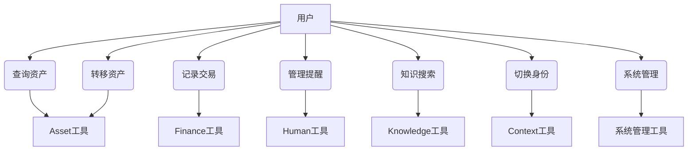

# Uni-Resource Agent 系统建模报告

## 1. 系统愿景与目标

### 1.1 系统定义
Uni-Resource Agent 是一个基于多上下文的AI代理系统，能够管理用户在不同身份（如工作、家庭、学校、个人）下的各种资源。该系统通过"一切皆资源"的概念，将物理资源、知识资源、人员资源和财务资源统一管理。

### 1.2 目标组织
- 企业员工：需要在工作和家庭间切换管理资源
- 家庭成员：需要管理家庭资产、人员、财务等资源
- 学生：需要在学习和生活间切换管理资源
- 自由职业者：需要在多个身份间切换管理资源，面临资源分散、缺乏统一入口、协作困难、沟通效率低等问题

### 1.3 核心利益相关者
- 个人用户：系统的主要交互对象，需要在不同身份间切换并管理各自资源
- 自由职业者：目标组织负责人，需要在多个身份间切换管理资源，面临资源分散、缺乏统一入口、协作困难、沟通效率低等问题

### 1.4 目标度量指标
- 提高个人资源管理效率
- 减少在不同身份间切换时的资源管理成本
- 实现跨身份资源的统一管理
- 降低资源管理的复杂度
- 提升协作效率和沟通效果

## 2. 业务用例分析

### 2.1 业务执行者
- 用户：系统的主要交互对象
- 系统：提供资源管理服务的AI代理
- 自由职业者：需要在多个身份间切换管理资源，面临资源分散、缺乏统一入口、协作困难、沟通效率低等问题

### 2.2 业务用例
1. 管理物理资源：查询、转移、记录资产
2. 管理知识资源：知识搜索、文档管理
3. 管理人员资源：提醒管理、健康追踪
4. 管理财务资源：记录交易、查询余额
5. 切换身份上下文：在不同身份间切换
6. 资源统一管理：统一管理跨身份的项目资源、客户资源等
7. 协作管理：提升与客户、合作伙伴的协作效率

## 3. 系统架构设计

### 3.1 系统组件
```
┌─────────────────────────────────────────────────────────────────────┐
│                          用户接口层                                 │
│                    (Gradio前端界面)                                 │
└─────────────┬─────────────────────────────────────────────────────┘
              │
┌─────────────▼─────────────────────────────────────────────────────┐
│                         代理核心层                                  │
│                    (LangChain Agent)                                │
│                                                                     │
│  ┌─────────────┐   ┌─────────────┐   ┌─────────────┐                │
│  │  资产工具   │   │  财务工具   │   │  人员工具   │                │
│  │  知识工具   │   │             │   │             │                │
│  └─────────────┘   └─────────────┘   └─────────────┘                │
└─────────────┬─────────────────────────────────────────────────────┘
              │
┌─────────────▼─────────────────────────────────────────────────────┐
│                         数据访问层                                  │
│                   (PostgreSQL + ChromaDB)                         │
│                                                                     │
│  ┌─────────────┐   ┌─────────────┐   ┌─────────────┐                │
│  │  数据库     │   │  向量库     │   │  模型引擎   │                │
│  │  (PostgreSQL)│   │  (ChromaDB) │   │  (llama.cpp)│                │
│  └─────────────┘   └─────────────┘   └─────────────┘                │
└─────────────┬─────────────────────────────────────────────────────┘
              │
┌─────────────▼─────────────────────────────────────────────────────┐
│                         数据存储层                                  │
│                                                                     │
│  ┌─────────────┐   ┌─────────────┐   ┌─────────────┐                │
│  │  上下文     │   │  物理资产   │   │  虚拟资产   │                │
│  │  (Contexts) │   │  (Assets)   │   │  (Virtual)  │                │
│  │  人员       │   │  (Personnel)│   │  (Knowledge)│                │
│  │  交易       │   │  (Transactions)│   │             │                │
│  └─────────────┘   └─────────────┘   └─────────────┘                │
└─────────────────────────────────────────────────────────────────────┘
```

### 3.2 数据流
1. 用户请求通过前端界面进入系统
2. 代理核心层分析请求并确定操作类型
3. 数据访问层根据操作类型访问对应数据存储
4. 系统返回处理结果给用户

## 4. 系统用例图



## 5. 核心类图设计

```mermaid
classDiagram
    class Agent {
        +oid
        +pid
        +context  # runtime: {oid, pid}
        +query_asset()
        +transfer_asset()
        +record_transaction()
        +manage_reminder()
        +rag_search()
        +switch_context()
    }
    
    # context 是运行时概念，由oid和pid组成
    # context = {oid, pid} 表示 "person@organization" 上下文
    
    class Asset {
        +id
        +oid
        +name
        +type
        +quantity
        +status
        +lifecycle_log
        +created_at
        +updated_at
    }
    
    class PhysicalAsset {
        +warehouse
        +location
    }
    
    class VirtualAsset {
        +content
        +embedding
    }
    
    class Personnel {
        +name
        +role
        +birth_date
        +health_reminders
        +created_at
        +updated_at
    }
    
    class Transaction {
        +amount
        +category
        +description
        +transaction_date
        +created_at
    }
    
    class Database {
        +get_connection()
        +init_tables()
    }
    
    class VectorDB {
        +query()
        +store()
    }
    
    Agent --> Context : manages
    Agent --> Asset : interacts with
    Agent --> Personnel : manages
    Agent --> Transaction : records
    Asset --> Context : belongs to
    PhysicalAsset --|> Asset
    VirtualAsset --|> Asset
    Agent --> Database : accesses
    Agent --> VectorDB : accesses
```

## 6. 详细用例规约

### 6.1 查询资产用例
- 执行者：用户
- 前置条件：用户已登录系统
- 后置条件：系统返回资产信息
- 基本路径：
  1. 用户请求查询资产
  2. 系统验证用户身份
  3. 系统查询当前上下文的资产
  4. 系统返回资产信息
- 扩展路径：
  1. 用户未登录：系统提示登录
  2. 无资产信息：系统返回无资产提示

### 6.2 转移资产用例
- 执行者：用户
- 前置条件：用户已登录系统
- 后置条件：资产成功转移
- 基本路径：
  1. 用户请求转移资产
  2. 系统验证用户身份
  3. 系统验证资产转移的合法性
  4. 系统执行资产转移
  5. 系统返回转移结果
- 扩展路径：
  1. 资产不足：系统提示资产不足
  2. 转移失败：系统提示转移失败原因

### 6.3 记录交易用例
- 执行者：用户
- 前置条件：用户已登录系统
- 后置条件：交易信息记录成功
- 基本路径：
  1. 用户请求记录交易
  2. 系统验证用户身份
  3. 系统记录交易信息
  4. 系统返回记录结果
- 扩展路径：
  1. 交易信息错误：系统提示错误并要求重新输入

### 6.4 资源统一管理用例
- 执行者：自由职业者
- 前置条件：自由职业者已登录系统并选择项目身份
- 后置条件：项目资源得到统一管理
- 基本路径：
  1. 自由职业者请求统一管理项目资源
  2. 系统验证用户身份和项目身份
  3. 系统提供项目资源统一管理界面
  4. 系统返回管理结果
- 扩展路径：
  1. 无项目资源：系统提示无资源信息
  2. 资源访问权限不足：系统提示权限不足

### 6.5 协作管理用例
- 执行者：自由职业者
- 前置条件：自由职业者已登录系统并准备与客户协作
- 后置条件：协作信息得到同步和管理
- 基本路径：
  1. 自由职业者请求协作管理
  2. 系统验证用户身份和协作需求
  3. 系统提供协作管理工具
  4. 系统返回协作结果
- 扩展路径：
  1. 客户资源不存在：系统提示客户信息不存在
  2. 协作权限不足：系统提示权限不足

## 7. 数据库设计

### 7.1 核心表结构

#### Context (运行时概念)
`context` 是程序运行时动态组合的概念，由两个核心标识组成：

| 标识 | 说明 | 作用 |
|------|------|------|
| `oid` (organization_id) | 组织ID | 标识当前操作所属的组织/空间 |
| `pid` (person_id) | 人员ID | 标识当前操作所属的人员/身份 |

**`context = {oid, pid}` 表示 "person@organization" 上下文**

例如：
- `Zhang San @ Company` → oid=1 (公司), pid=101 (张三)
- `Zhang San @ Home` → oid=2 (家庭), pid=101 (张三)
- `Li Si @ School` → oid=3 (学校), pid=102 (李四)

> 注意：`oid` 和 `pid` 作为组合字段存在于所有数据表中，但不作为独立表存在。每条记录通过 `(oid, pid)` 的组合实现多租户和多身份隔离。`context_id` 参数在API中已被废弃，统一使用 `oid` + `pid` 传递。

1. **physical_assets** — 物理资产表
    - id: 主键
    - oid: 组织ID
    - pid: 人员ID
    - name: 资产名称
    - type: 资产类型
    - quantity: 数量
    - status: 状态
    - lifecycle_log: 生命周期日志

2. **virtual_assets** — 虚拟资产表
    - id: 主键
    - oid: 组织ID
    - pid: 人员ID
    - name: 资产名称
    - content: 内容
    - embedding: 向量嵌入

3. **personnel** — 人员表
    - id: 主键
    - oid: 组织ID
    - pid: 人员ID
    - name: 姓名
    - role: 角色
    - birth_date: 生日
    - health_reminders: 健康提醒（JSONB）

4. **transactions** — 交易表
     - id: 主键
     - oid: 组织ID
     - pid: 人员ID
     - amount: 金额
     - category: 类别
     - description: 描述
     - transaction_date: 交易日期

## 8. 设计模式应用

### 8.1 人员管理模式
- 人员信息通过联系方式关联
- 联系方式类型和用途分离
- 人员关系通过自反关联表达

### 8.2 资源管理模式
- 资源按类型分层管理
- 通过上下文隔离不同身份的资源
- 资源操作遵循统一的接口规范

## 9. 实施计划

### 9.1 第一阶段：需求分析
- 完善需求文档
- 明确系统约束条件

### 9.2 第二阶段：系统设计
- 设计系统架构
- 创建详细类图和用例图

### 9.3 第三阶段：实现
- 基于设计文档实现系统功能

### 9.4 第四阶段：测试
- 测试系统功能
- 验证系统符合设计要求

## 10. 验证方法

- 通过检查设计文档验证系统设计
- 通过代码实现验证系统功能
- 通过测试验证系统正确性